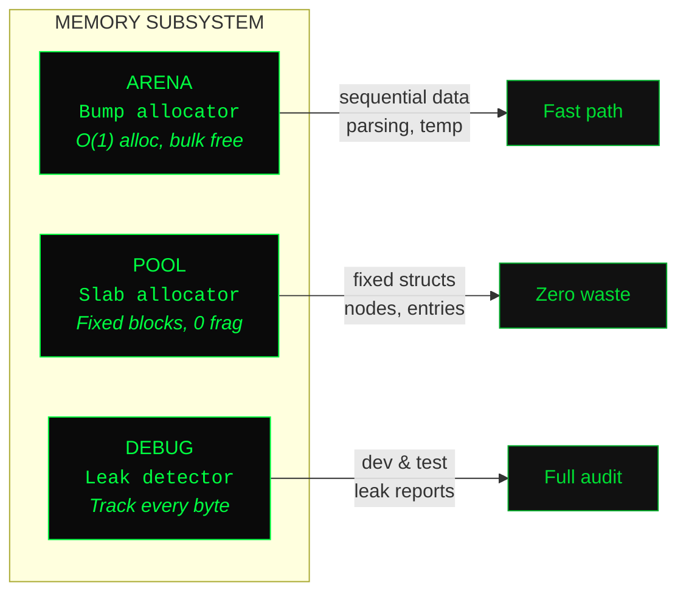
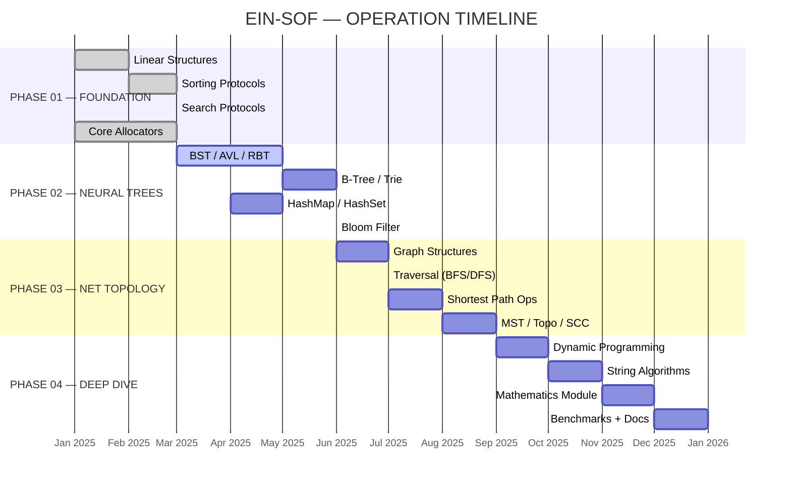

<div align="center">

<!-- ═══════════════════════════════════════════════════════════════════ -->
<!--                    GHOST IN THE SHELL AESTHETIC                     -->
<!--              [ S E C T I O N  9  //  O P S  B R I E F ]            -->
<!-- ═══════════════════════════════════════════════════════════════════ -->

```
                          ██████████████████████████████
                     █████░░░░░░░░░░░░░░░░░░░░░░░░░░░░█████
                  ███░░░░░░░░░░░░░░░░░░░░░░░░░░░░░░░░░░░░░███
                ██░░░░░░░░░░░░░░░░░░░░░░░░░░░░░░░░░░░░░░░░░░██
              ██░░░░░░░░░░░░░░░░░░░░░░░░░░░░░░░░░░░░░░░░░░░░░░██
             █░░░░░░░░░░░░░░░░░░░░░░░░░░░░░░░░░░░░░░░░░░░░░░░░░█
            █░░░░░░░░░░░░░░ EIN-SOF  アインソフ ░░░░░░░░░░░░░░░█
            █░░░░░░░░░ ALGORITHM  LABORATORY ░░░░░░░░░░░█
             █░░░░░░░░░░░░░░░░░░░░░░░░░░░░░░░░░░░░░░░░░░░░░░░░░█
              ██░░░░░░░░░░░░░░░░░░░░░░░░░░░░░░░░░░░░░░░░░░░░░░██
                ██░░░░░░░░░░░░░░░░░░░░░░░░░░░░░░░░░░░░░░░░░░██
                  ███░░░░░░░░░░░░░░░░░░░░░░░░░░░░░░░░░░░░░███
                     █████░░░░░░░░░░░░░░░░░░░░░░░░░░░░█████
                          ██████████████████████████████
```

<br>

```
┌─────────────────────────────────────────────────────────────────┐
│  PUBLIC SECURITY SECTION 9 — ALGORITHMIC WARFARE DIVISION       │
│  ═══════════════════════════════════════════════════════════════ │
│                                                                 │
│  PROJECT:     Ein-Sof  [ אין סוף ]                              │
│  CLASS:       Algorithm Laboratory — Pure C Implementation      │
│  CLEARANCE:   OPEN SOURCE // MIT LICENSE                        │
│  STATUS:      ██████████░░░░ 68% OPERATIONAL                    │
│                                                                 │
│  "Your ghost whispers algorithms.                               │
│   Your shell executes them."                                    │
│                                                                 │
└─────────────────────────────────────────────────────────────────┘
```

<br>

[](LICENSE)
[](https://en.wikipedia.org/wiki/C99)
[](#-deployment)
[](#-integrity-scan)
[](#)
[](#)

<br>

> _The Net is vast and infinite._
>
> **Ein-Sof** (אין סוף) — _"Without End."_ In the Kabbalistic tradition, the boundless light
> before all creation. In this laboratory, every algorithm and data structure is built
> **from nothing** — pure C, zero dependencies, raw memory manipulation. No external shells.
> No borrowed ghosts. Only your own cyberbrain, interfacing directly with the machine.

<br>

[`DIVE IN`](#-net-dive-quickstart) · [`MODULES`](#-cyberbrain-architecture) · [`ROADMAP`](#-operation-timeline) · [`CONTRIBUTE`](#-join-section-9)

---

</div>

<br>

## `> MANIFESTO`

```
┌──────────────────────────────────────────────────────────────┐
│ root@section9:~/ein-sof$ cat /var/log/manifesto.log         │
│                                                              │
│ [DOCTRINE] This is not a library. This is a laboratory.     │
│ [DOCTRINE] Every byte is accounted for.                     │
│ [DOCTRINE] Every allocation has a purpose.                  │
│ [DOCTRINE] There are no abstractions you didn't build.      │
│ [DOCTRINE] The ghost in your machine understands the shell. │
│                                                              │
│ root@section9:~/ein-sof$ _                                  │
└──────────────────────────────────────────────────────────────┘
```

Ein-Sof opère selon quatre directives fondamentales :

**`DIRECTIVE 01`** — **Zero dependency.** Chaque structure, chaque algorithme est forgé from scratch. Aucun fantôme étranger dans le shell.

**`DIRECTIVE 02`** — **Memory-first.** Gestion manuelle de chaque octet. Tu sais exactement où vit chaque pointeur, combien coûte chaque allocation, et quand la mémoire est libérée.

**`DIRECTIVE 03`** — **Complexity-aware.** Chaque implémentation est annotée avec sa complexité théorique, puis benchmarkée sur le terrain. La théorie rencontre le silicium.

**`DIRECTIVE 04`** — **Battle-tested.** 247+ tests unitaires. Edge cases. Stress tests. Fuzzing. Valgrind. Aucune fuite. Aucun undefined behavior.

```c
// Ein-Sof ne cache rien. Chaque octet est intentionnel.
t_vec *vec = es_vec_new(sizeof(int));
es_vec_push(vec, &(int){42});
// Tu sais exactement ce qui se passe dans le cyberbrain.
```

<br>

## `> CYBERBRAIN ARCHITECTURE`

```mermaid
graph TD
    A["<b>⬡ EIN-SOF</b><br/><code>root kernel</code>"]:::core --> B["<b>LAYER 01</b><br/>Data Structures"]:::layer
    A --> C["<b>LAYER 02</b><br/>Algorithms"]:::layer
    A --> D["<b>LAYER 03</b><br/>Mathematics"]:::layer
    A --> E["<b>LAYER 00</b><br/>Core Runtime"]:::layer

    B --> B1["LINEAR<br/><code>array · list · stack<br/>queue · deque</code>"]:::node
    B --> B2["TREES<br/><code>bst · avl · rbt<br/>b-tree · trie</code>"]:::node
    B --> B3["HASH<br/><code>hashmap · hashset<br/>bloom filter</code>"]:::node
    B --> B4["GRAPH<br/><code>adj list · adj matrix<br/>weighted · directed</code>"]:::node

    C --> C1["SORT<br/><code>bubble → radix<br/>10 implementations</code>"]:::node
    C --> C2["SEARCH<br/><code>linear → interpolation<br/>4 implementations</code>"]:::node
    C --> C3["GRAPH OPS<br/><code>BFS · DFS · Dijkstra<br/>A* · Kruskal · Prim</code>"]:::node
    C --> C4["DYNAMIC PROG<br/><code>knapsack · LCS<br/>edit dist · LIS</code>"]:::node

    D --> D1["ARITHMETIC<br/><code>bigint · modular<br/>prime sieve</code>"]:::node
    D --> D2["LINEAR ALG<br/><code>matrix ops<br/>determinant · inverse</code>"]:::node

    E --> E1["MEMORY<br/><code>arena · pool<br/>debug alloc</code>"]:::node
    E --> E2["I/O<br/><code>format · debug<br/>serialize</code>"]:::node

    classDef core fill:#0a0a0a,stroke:#00ff41,stroke-width:2px,color:#00ff41
    classDef layer fill:#0d0d0d,stroke:#00cc33,color:#00ff41
    classDef node fill:#111111,stroke:#00aa2a,color:#00dd33
```



<br>

## `> FILESYSTEM MAP`

```
ein-sof/
│
│   ┌─────────────────────────────────────────────────────────┐
│   │  SECTION 9 — FILE SYSTEM ARCHITECTURE                   │
│   │  Clearance Level: PUBLIC                                │
│   └─────────────────────────────────────────────────────────┘
│
├── Makefile ··················· build protocol
├── README.md ·················· this briefing
├── LICENSE ···················· MIT clearance
│
├── include/ ··················· [ PUBLIC INTERFACE LAYER ]
│   ├── einsof.h ··············· master include — single entry point
│   ├── ds/ ···················· data structure headers
│   │   ├── vector.h
│   │   ├── linked_list.h
│   │   ├── stack.h
│   │   ├── queue.h
│   │   ├── deque.h
│   │   ├── hashmap.h
│   │   ├── hashset.h
│   │   ├── bst.h
│   │   ├── avl.h
│   │   ├── rbtree.h
│   │   ├── btree.h
│   │   ├── trie.h
│   │   ├── heap.h
│   │   ├── graph.h
│   │   └── bloom.h
│   ├── algo/ ·················· algorithm headers
│   │   ├── sort.h
│   │   ├── search.h
│   │   ├── graph_algo.h
│   │   ├── dp.h
│   │   └── string_algo.h
│   ├── math/ ·················· mathematics headers
│   │   ├── bigint.h
│   │   ├── matrix.h
│   │   └── prime.h
│   └── core/ ·················· runtime headers
│       ├── arena.h
│       ├── pool.h
│       ├── debug.h
│       └── types.h
│
├── src/ ······················· [ IMPLEMENTATION LAYER ]
│   ├── ds/     ················ mirrors include/ds/
│   ├── algo/   ················ mirrors include/algo/
│   ├── math/   ················ mirrors include/math/
│   └── core/   ················ mirrors include/core/
│
├── tests/ ····················· [ INTEGRITY VERIFICATION ]
│   ├── test_vector.c
│   ├── test_hashmap.c
│   ├── test_sort.c
│   └── ...
│
├── bench/ ····················· [ PERFORMANCE ANALYSIS ]
│   ├── bench_sort.c
│   └── bench_hashmap.c
│
└── docs/ ······················ [ CLASSIFIED DOCUMENTATION ]
    ├── COMPLEXITY.md
    ├── MEMORY_MODEL.md
    └── diagrams/
```

<br>

## `> MODULES DATABASE`

<!-- ═══════════════════════════════════════════════════ -->
<!--              LAYER 01 — DATA STRUCTURES            -->
<!-- ═══════════════════════════════════════════════════ -->

### `LAYER 01` — Data Structures

<details>
<summary>

```
[ACCESSING] ░░░░░░░░░░░░ LINEAR STRUCTURES — vector · linked_list · stack · queue · deque
```

</summary>

<br>

```
┌───────────────────────────────────────────────────────────────────────────────┐
│ STRUCTURE        │ DESCRIPTION                    │ ACCESS │ INSERT │ DELETE  │
├───────────────────────────────────────────────────────────────────────────────┤
│ Vector           │ Dynamic array, amortized grow  │ O(1)   │ O(1)†  │ O(n)   │
│ Linked List      │ Doubly-linked, sentinel nodes  │ O(n)   │ O(1)   │ O(1)   │
│ Stack            │ LIFO — array-backed            │ O(1)   │ O(1)   │ O(1)   │
│ Queue            │ FIFO — circular buffer         │ O(1)   │ O(1)   │ O(1)   │
│ Deque            │ Double-ended queue             │ O(1)   │ O(1)   │ O(1)   │
├───────────────────────────────────────────────────────────────────────────────┤
│ † amortized                                        Space: O(n) for all      │
└───────────────────────────────────────────────────────────────────────────────┘
```

```c
// ═══ VECTOR — Generic dynamic array ═══
// Like prosthetic memory — grows as needed, instant recall.

t_vec *v = es_vec_new(sizeof(int));

for (int i = 0; i < 100; i++)
    es_vec_push(v, &i);               // amortized O(1)

int *ptr = es_vec_at(v, 42);          // O(1) — direct memory access
es_vec_pop(v, NULL);                   // O(1) — remove last
es_vec_insert(v, 0, &(int){-1});      // O(n) — shift elements
es_vec_free(v);                        // release prosthetic

// ═══ LINKED LIST — Doubly-linked with sentinels ═══
// Neural pathways — each node knows its neighbors.

t_list *lst = es_list_new(sizeof(int));
es_list_push_back(lst, &(int){1});
es_list_push_front(lst, &(int){0});

t_node *node = es_list_find(lst, &(int){1}, int_cmp);
es_list_remove(lst, node);            // O(1) — sever the link
es_list_free(lst);
```

</details>

<details>
<summary>

```
[ACCESSING] ░░░░░░░░░░░░ TREE STRUCTURES — bst · avl · rbtree · btree · trie · heap
```

</summary>

<br>

```
┌───────────────────────────────────────────────────────────────────────────────┐
│ STRUCTURE        │ DESCRIPTION                    │ SEARCH │ INSERT │ DELETE  │
├───────────────────────────────────────────────────────────────────────────────┤
│ BST              │ Binary Search Tree (unbal.)    │ O(h)   │ O(h)   │ O(h)   │
│ AVL              │ Height-balanced BST            │ O(㏒n) │ O(㏒n) │ O(㏒n) │
│ Red-Black        │ Color-invariant BST            │ O(㏒n) │ O(㏒n) │ O(㏒n) │
│ B-Tree           │ Multi-way balanced (order m)   │ O(㏒n) │ O(㏒n) │ O(㏒n) │
│ Trie             │ Prefix tree for strings        │ O(k)   │ O(k)   │ O(k)   │
│ Binary Heap      │ Min/Max — array-backed         │ O(n)   │ O(㏒n) │ O(㏒n) │
├───────────────────────────────────────────────────────────────────────────────┤
│ h = height · k = key length · Space: O(n), Trie: O(Σ·k)                     │
└───────────────────────────────────────────────────────────────────────────────┘
```

```c
// ═══ AVL TREE — Self-balancing architecture ═══
// Like a cyberbrain's memory hierarchy — always optimally balanced.

t_avl *tree = es_avl_new(int_cmp);
int keys[] = {50, 30, 70, 20, 40, 60, 80};

for (int i = 0; i < 7; i++)
    es_avl_insert(tree, &keys[i]);

// Tree auto-balances after every operation.
// Height never exceeds 1.44 * log2(n+2)
es_avl_traverse(tree, ES_INORDER, print_int);
es_avl_free(tree);

// ═══ TRIE — Prefix neural network ═══
// Every character is a synapse. Every word, a memory.

t_trie *trie = es_trie_new();
es_trie_insert(trie, "ghost");
es_trie_insert(trie, "ghoul");
es_trie_insert(trie, "algorithm");

bool found = es_trie_search(trie, "ghost");       // true
int count  = es_trie_prefix_count(trie, "gh");     // 2

// Autocomplete — the cyberbrain suggests
t_vec *suggestions = es_trie_autocomplete(trie, "gho");
// → ["ghost", "ghoul"]
```

</details>

<details>
<summary>

```
[ACCESSING] ░░░░░░░░░░░░ HASH STRUCTURES — hashmap · hashset · bloom filter
```

</summary>

<br>

```
┌───────────────────────────────────────────────────────────────────────────────┐
│ STRUCTURE        │ DESCRIPTION                    │ LOOKUP │ INSERT │ DELETE  │
├───────────────────────────────────────────────────────────────────────────────┤
│ HashMap          │ Open addr + Robin Hood         │ O(1)*  │ O(1)*  │ O(1)*  │
│ HashSet          │ Unique keys, no values         │ O(1)*  │ O(1)*  │ O(1)*  │
│ Bloom Filter     │ Probabilistic membership       │ O(k)   │ O(k)   │  ✗     │
├───────────────────────────────────────────────────────────────────────────────┤
│ * average case · k = hash functions · Space: O(n), Bloom: O(m)               │
└───────────────────────────────────────────────────────────────────────────────┘
```

```c
// ═══ HASHMAP — Robin Hood hashing ═══
// Steal from the rich (long probe sequences), give to the poor.
// Like Section 9's resource allocation — ruthlessly efficient.

t_map *map = es_map_new(sizeof(char *), sizeof(int), str_hash, str_eq);

es_map_put(map, &(char *){"kusanagi"}, &(int){2501});
es_map_put(map, &(char *){"batou"},    &(int){2502});
es_map_put(map, &(char *){"togusa"},   &(int){2503});

int *id = es_map_get(map, &(char *){"kusanagi"});
printf("Agent ID: %d\n", *id);                    // 2501

printf("Load factor: %.2f\n", es_map_load_factor(map));
es_map_free(map);

// ═══ BLOOM FILTER — Probabilistic ghost detection ═══
// "Is this ghost in the system?" — Maybe. Never certainly no when yes.

t_bloom *bf = es_bloom_new(1000000, 0.01);  // 1M entries, 1% false positive
es_bloom_add(bf, "target_alpha", 12);
es_bloom_check(bf, "target_alpha", 12);     // definitely present
es_bloom_check(bf, "target_beta", 11);      // probably absent
```

</details>

<details>
<summary>

```
[ACCESSING] ░░░░░░░░░░░░ GRAPH STRUCTURES — adjacency list · matrix · weighted
```

</summary>

<br>

```c
// ═══ GRAPH — Network topology ═══
// The Net is vast and infinite. Model it.

t_graph *net = es_graph_new(ES_DIRECTED | ES_WEIGHTED);

size_t niihama  = es_graph_add_vertex(net, "Niihama");
size_t newport  = es_graph_add_vertex(net, "Newport_City");
size_t dejima   = es_graph_add_vertex(net, "Dejima");

es_graph_add_edge(net, niihama, newport,  4.0);
es_graph_add_edge(net, niihama, dejima,   2.0);
es_graph_add_edge(net, dejima,  newport,  1.0);

// Trace all connections from a node
t_edge_iter it = es_graph_neighbors(net, niihama);
while (es_edge_next(&it)) {
    printf("[LINK] %s ──%.1f──▸ %s\n",
        es_graph_label(net, it.from),
        it.weight,
        es_graph_label(net, it.to));
}
// [LINK] Niihama ──4.0──▸ Newport_City
// [LINK] Niihama ──2.0──▸ Dejima

es_graph_free(net);
```

</details>

<br>

<!-- ═══════════════════════════════════════════════════ -->
<!--              LAYER 02 — ALGORITHMS                 -->
<!-- ═══════════════════════════════════════════════════ -->

### `LAYER 02` — Algorithms

<details>
<summary>

```
[ACCESSING] ░░░░░░░░░░░░ SORTING PROTOCOLS — 10 algorithms // bubble → radix
```

</summary>

<br>

```
┌───────────────────────────────────────────────────────────────────────────────┐
│ PROTOCOL         │ BEST       │ AVERAGE    │ WORST      │ MEM   │ STABLE    │
├───────────────────────────────────────────────────────────────────────────────┤
│ Bubble Sort      │ O(n)       │ O(n²)      │ O(n²)      │ O(1)  │ yes       │
│ Selection Sort   │ O(n²)      │ O(n²)      │ O(n²)      │ O(1)  │ no        │
│ Insertion Sort   │ O(n)       │ O(n²)      │ O(n²)      │ O(1)  │ yes       │
│ Shell Sort       │ O(n㏒n)    │ O(n^1.25)  │ O(n²)      │ O(1)  │ no        │
│ Merge Sort       │ O(n㏒n)    │ O(n㏒n)    │ O(n㏒n)    │ O(n)  │ yes       │
│ Quick Sort       │ O(n㏒n)    │ O(n㏒n)    │ O(n²)      │ O(㏒n)│ no        │
│ Heap Sort        │ O(n㏒n)    │ O(n㏒n)    │ O(n㏒n)    │ O(1)  │ no        │
│ Counting Sort    │ O(n+k)     │ O(n+k)     │ O(n+k)     │ O(k)  │ yes       │
│ Radix Sort       │ O(nk)      │ O(nk)      │ O(nk)      │ O(n+k)│ yes       │
│ Tim Sort         │ O(n)       │ O(n㏒n)    │ O(n㏒n)    │ O(n)  │ yes       │
└───────────────────────────────────────────────────────────────────────────────┘
```

```c
int targets[] = {64, 34, 25, 12, 22, 11, 90};
size_t n = sizeof(targets) / sizeof(targets[0]);

// ═══ Generic interface — swap protocols at will ═══
es_sort(targets, n, sizeof(int), int_cmp, ES_MERGESORT);
es_sort(targets, n, sizeof(int), int_cmp, ES_QUICKSORT);
es_sort(targets, n, sizeof(int), int_cmp, ES_HEAPSORT);

// ═══ Fine-tuned control ═══
es_quicksort(targets, n, sizeof(int), int_cmp, ES_PIVOT_MEDIAN3);
es_mergesort(targets, n, sizeof(int), int_cmp, ES_BOTTOM_UP);
```

</details>

<details>
<summary>

```
[ACCESSING] ░░░░░░░░░░░░ SEARCH PROTOCOLS — linear · binary · interpolation · exponential
```

</summary>

<br>

```
┌───────────────────────────────────────────────────────────────────────────────┐
│ PROTOCOL         │ BEST       │ AVERAGE      │ WORST      │ REQUIRES         │
├───────────────────────────────────────────────────────────────────────────────┤
│ Linear Search    │ O(1)       │ O(n)         │ O(n)       │ —                │
│ Binary Search    │ O(1)       │ O(㏒n)       │ O(㏒n)     │ sorted           │
│ Interpolation    │ O(1)       │ O(㏒㏒n)     │ O(n)       │ sorted + uniform │
│ Exponential      │ O(1)       │ O(㏒n)       │ O(㏒n)     │ sorted           │
└───────────────────────────────────────────────────────────────────────────────┘
```

```c
int sorted_ids[] = {2, 5, 8, 12, 16, 23, 38, 56, 72, 91};
size_t n = 10;

// Binary search — locate target in the Net
ssize_t idx = es_bsearch(sorted_ids, n, sizeof(int), &(int){23}, int_cmp);
// idx == 5 — target acquired

// Lower/Upper bound — narrow the search perimeter
ssize_t lo = es_lower_bound(sorted_ids, n, sizeof(int), &(int){15}, int_cmp);
ssize_t hi = es_upper_bound(sorted_ids, n, sizeof(int), &(int){23}, int_cmp);
```

</details>

<details>
<summary>

```
[ACCESSING] ░░░░░░░░░░░░ GRAPH OPERATIONS — traversal · shortest path · MST · topology
```

</summary>

<br>

```
┌───────────────────────────────────────────────────────────────────────────────┐
│ OPERATION        │ COMPLEXITY     │ CLASS          │ MISSION                  │
├───────────────────────────────────────────────────────────────────────────────┤
│ BFS              │ O(V+E)         │ Traversal      │ Shortest (unweighted)    │
│ DFS              │ O(V+E)         │ Traversal      │ Cycle detect, topo sort  │
│ Dijkstra         │ O((V+E)㏒V)   │ Shortest Path  │ Non-negative weights     │
│ Bellman-Ford     │ O(V·E)         │ Shortest Path  │ Negative weights         │
│ Floyd-Warshall   │ O(V³)          │ All-Pairs SP   │ Dense network analysis   │
│ A*               │ O(E)           │ Shortest Path  │ Heuristic-guided ops     │
│ Kruskal          │ O(E㏒E)       │ MST            │ Sparse networks          │
│ Prim             │ O((V+E)㏒V)   │ MST            │ Dense networks           │
│ Tarjan           │ O(V+E)         │ SCC            │ Component isolation      │
│ Topological Sort │ O(V+E)         │ Ordering       │ DAG task scheduling      │
└───────────────────────────────────────────────────────────────────────────────┘
```

```c
// ═══ DIJKSTRA — Trace the shortest route through the Net ═══
t_path *route = es_dijkstra(network, origin, target);
printf("[TRACE] Distance: %.2f\n", route->distance);
printf("[TRACE] Route: ");
for (size_t i = 0; i < route->len; i++)
    printf("%s → ", es_graph_label(network, route->nodes[i]));
es_path_free(route);

// ═══ A* — Guided net-dive with heuristic ═══
t_path *route = es_astar(network, origin, target, manhattan_heuristic);

// ═══ TOPOLOGICAL SORT — Operation scheduling ═══
t_vec *schedule = es_topo_sort(network);
// Returns NULL if cyclic dependency detected
```

</details>

<details>
<summary>

```
[ACCESSING] ░░░░░░░░░░░░ DYNAMIC PROGRAMMING — memoization · tabulation · optimization
```

</summary>

<br>

```
┌───────────────────────────────────────────────────────────────────────────────┐
│ PROBLEM          │ TIME       │ SPACE      │ TECHNIQUE                        │
├───────────────────────────────────────────────────────────────────────────────┤
│ Fibonacci        │ O(n)       │ O(1)       │ Bottom-up iterative              │
│ Knapsack 0/1     │ O(nW)      │ O(W)       │ Space-optimized tabulation       │
│ LCS              │ O(mn)      │ O(min)     │ Hirschberg's algorithm           │
│ Edit Distance    │ O(mn)      │ O(min)     │ Wagner-Fischer                   │
│ LIS              │ O(n㏒n)    │ O(n)       │ Patience sorting                 │
│ Coin Change      │ O(nS)      │ O(S)       │ Bottom-up                        │
│ Matrix Chain     │ O(n³)      │ O(n²)      │ Interval DP                      │
└───────────────────────────────────────────────────────────────────────────────┘
```

```c
// ═══ LONGEST COMMON SUBSEQUENCE ═══
// Find the shared memory between two ghost-lines.
t_lcs_result res = es_lcs("ABCBDAB", "BDCAB");
printf("[MATCH] Length: %zu\n", res.length);     // 4
printf("[MATCH] Sequence: %s\n", res.sequence);  // "BCAB"
es_lcs_free(&res);

// ═══ EDIT DISTANCE — Ghost-line divergence metric ═══
size_t dist = es_edit_distance("kitten", "sitting");  // 3

// ═══ 0/1 KNAPSACK — Optimal resource allocation ═══
t_item gear[] = {{60, 10}, {100, 20}, {120, 30}};
int optimal = es_knapsack_01(gear, 3, 50);  // 220
```

</details>

<details>
<summary>

```
[ACCESSING] ░░░░░░░░░░░░ STRING ALGORITHMS — pattern matching · hashing · analysis
```

</summary>

<br>

```
┌───────────────────────────────────────────────────────────────────────────────┐
│ ALGORITHM        │ COMPLEXITY     │ MISSION                                  │
├───────────────────────────────────────────────────────────────────────────────┤
│ KMP              │ O(n+m)         │ Single pattern intercept                 │
│ Rabin-Karp       │ O(n+m)*        │ Multi-pattern / rolling hash scan        │
│ Boyer-Moore      │ O(n/m) best    │ Large alphabet operations                │
│ Aho-Corasick     │ O(n+m+z)       │ Simultaneous multi-pattern sweep         │
│ Z-Algorithm      │ O(n)           │ Pattern matching + string forensics      │
│ Manacher         │ O(n)           │ Longest palindromic substring            │
└───────────────────────────────────────────────────────────────────────────────┘
```

```c
// ═══ KMP — Pattern intercept in data stream ═══
t_vec *hits = es_kmp_search("AABAACAADAABAABA", "AABA");
// hits: [0, 9, 12] — three intercept points

// ═══ RABIN-KARP — Rolling hash surveillance ═══
t_vec *hits = es_rabin_karp(datastream, signature, ES_HASH_FNV1A);
```

</details>

<br>

<!-- ═══════════════════════════════════════════════════ -->
<!--              LAYER 03 — MATHEMATICS                -->
<!-- ═══════════════════════════════════════════════════ -->

### `LAYER 03` — Mathematics

<details>
<summary>

```
[ACCESSING] ░░░░░░░░░░░░ ARITHMETIC & NUMBER THEORY — bigint · modular · primes
```

</summary>

<br>

```c
// ═══ BIG INTEGER — Arbitrary precision computation ═══
// When standard types can't hold the weight of infinity.

t_bigint *a = es_bigint_from_str("123456789012345678901234567890");
t_bigint *b = es_bigint_from_str("987654321098765432109876543210");
t_bigint *c = es_bigint_mul(a, b);
char *result = es_bigint_to_str(c);
printf("[COMPUTE] %s\n", result);

// ═══ PRIMES — The atoms of arithmetic ═══
bool is_prime = es_is_prime(1000000007);            // Miller-Rabin
t_vec *primes = es_sieve_of_eratosthenes(1000000);  // All primes ≤ 10⁶

// ═══ MODULAR — Cryptographic building blocks ═══
uint64_t r   = es_mod_pow(2, 64, 1000000007);      // Fast exponentiation
uint64_t inv = es_mod_inv(3, 1000000007);            // Fermat's little theorem
```

</details>

<details>
<summary>

```
[ACCESSING] ░░░░░░░░░░░░ LINEAR ALGEBRA — matrix ops · determinant · inverse
```

</summary>

<br>

```c
// ═══ MATRIX OPERATIONS ═══
t_matrix *A = es_mat_new(3, 3);
t_matrix *B = es_mat_new(3, 3);

t_matrix *C = es_mat_mul(A, B);           // O(n³) — standard
t_matrix *D = es_mat_mul_strassen(A, B);  // O(n^2.807) — Strassen

double det    = es_mat_determinant(A);     // LU decomposition
t_matrix *inv = es_mat_inverse(A);
t_matrix *T   = es_mat_transpose(A);

es_mat_free(A);
es_mat_free(B);
```

</details>

<br>

<!-- ═══════════════════════════════════════════════════ -->
<!--              LAYER 00 — CORE RUNTIME               -->
<!-- ═══════════════════════════════════════════════════ -->

### `LAYER 00` — Core Runtime

<details>
<summary>

```
[ACCESSING] ░░░░░░░░░░░░ MEMORY MANAGEMENT — arena · pool · debug allocator
```

</summary>

<br>



```c
// ═══ ARENA — Prosthetic memory bank ═══
// Allocate fast, free everything at once. Like wiping a cyberbrain.

t_arena *arena = es_arena_new(4096);                // 4KB memory region
int *data  = es_arena_alloc(arena, sizeof(int) * 100);
char *name = es_arena_alloc(arena, 256);
// No individual frees. One command wipes everything.
es_arena_destroy(arena);

// ═══ POOL — Cybernetic organ bank ═══
// Pre-allocated fixed-size blocks. Zero fragmentation. Instant recycling.

t_pool *pool = es_pool_new(sizeof(t_node), 1024);  // 1024 pre-built slots
t_node *n1 = es_pool_alloc(pool);                   // O(1) — grab a slot
t_node *n2 = es_pool_alloc(pool);
es_pool_free(pool, n1);                              // O(1) — recycle
es_pool_destroy(pool);

// ═══ DEBUG ALLOCATOR — Ghost surveillance ═══
// Every malloc tracked. Every leak exposed. No ghost escapes.

t_dbg_alloc *dbg = es_dbg_alloc_new();
void *ptr = es_dbg_malloc(dbg, 64, __FILE__, __LINE__);
// ... forget to free ...
es_dbg_report(dbg);
// ┌─────────────────────────────────────────────────────┐
// │ [LEAK] 64 bytes @ main.c:42 — NEVER FREED          │
// │ [AUDIT] Total: 1 leak, 64 bytes lost                │
// └─────────────────────────────────────────────────────┘
```

</details>

<br>

## `> NET-DIVE QUICKSTART`

```
┌──────────────────────────────────────────────────────────────┐
│ PREREQUISITES                                                │
├──────────────────────┬───────────────┬───────────────────────┤
│ gcc / clang          │ C99+          │ Compiler              │
│ make                 │ 4.0+          │ Build system          │
│ criterion            │ 2.4+          │ Testing (optional)    │
│ valgrind             │ 3.15+         │ Memory audit (opt.)   │
└──────────────────────┴───────────────┴───────────────────────┘
```

```bash
# ═══ INITIALIZE ═══
git clone https://github.com/yourusername/ein-sof.git
cd ein-sof

# ═══ BUILD PROTOCOLS ═══
make                   # compile static library
make debug             # debug symbols + sanitizers enabled
make test              # build & execute full test suite
make bench             # run performance benchmarks
make valgrind          # memory integrity scan
make docs              # generate documentation
make clean             # remove build artifacts
make fclean            # full purge — remove library

# ═══ LINK ═══
gcc -I./include my_program.c -L. -leinsof -o my_program
```

```c
// my_program.c — single include, full access
#include "einsof.h"

int main(void)
{
    t_vec *v = es_vec_new(sizeof(int));

    for (int i = 0; i < 1000; i++)
        es_vec_push(v, &i);

    es_sort(es_vec_data(v), es_vec_len(v),
            sizeof(int), int_cmp, ES_QUICKSORT);

    ssize_t idx = es_bsearch(
        es_vec_data(v), es_vec_len(v),
        sizeof(int), &(int){42}, int_cmp
    );

    printf("[FOUND] Target 42 at index %zd\n", idx);
    es_vec_free(v);
    return 0;
}
```

<br>

## `> INTEGRITY SCAN`

```bash
make test                    # full suite
make test SUITE=vector       # specific module
make test SUITE=hashmap
make test SUITE=sort
make test VERBOSE=1          # detailed output
make test MEMCHECK=1         # Valgrind integration
```

```
┌──────────────────────────────────────────────────────────────┐
│ root@section9:~/ein-sof$ make test                          │
│                                                              │
│ [====] Synthesis: Tested: 247  Passing: 247                 │
│                   Failing: 0   Crashing: 0                  │
│                                                              │
│ [INTEGRITY] ██████████████████████████████ 100% CLEAN        │
│ [MEMORY]    0 leaks detected                                │
│ [STATUS]    ALL SYSTEMS OPERATIONAL                          │
│                                                              │
│ root@section9:~/ein-sof$ _                                  │
└──────────────────────────────────────────────────────────────┘
```

<details>
<summary>

```
[EXPAND] ░░░░░░░░░░░░ DETAILED TEST COVERAGE REPORT
```

</summary>

<br>

```
┌─────────────────────┬───────┬────────────┬──────────────────┐
│ MODULE              │ TESTS │ EDGE CASES │ STRESS TESTS     │
├─────────────────────┼───────┼────────────┼──────────────────┤
│ Vector              │    28 │     ✓      │ ✓ 10M elements   │
│ Linked List         │    24 │     ✓      │ ✓                │
│ HashMap             │    32 │     ✓      │ ✓ high collision │
│ AVL Tree            │    26 │     ✓      │ ✓ seq. insert    │
│ Red-Black Tree      │    30 │     ✓      │ ✓                │
│ Sorting             │    40 │     ✓      │ ✓ 1M elements    │
│ Graph Algorithms    │    35 │     ✓      │ ✓ 100K vertices  │
│ String Algorithms   │    22 │     ✓      │ ✓                │
│ Dynamic Programming │    18 │     ✓      │  —               │
├─────────────────────┼───────┼────────────┼──────────────────┤
│ TOTAL               │   247 │    ALL     │                  │
└─────────────────────┴───────┴────────────┴──────────────────┘
```

</details>

<br>

## `> PERFORMANCE ANALYSIS`

```bash
make bench
```

<details>
<summary>

```
[EXPAND] ░░░░░░░░░░░░ SORTING — 1M random integers
```

</summary>

<br>

```
┌──────────────────────────────────────────────────────────────┐
│ SORT BENCHMARK — 1,000,000 random int32                      │
│ CPU: [REDACTED] — Compiler: gcc -O2                         │
├──────────────────┬───────────────┬───────────────────────────┤
│ PROTOCOL         │ TIME (ms)     │ COMPARISONS               │
├──────────────────┼───────────────┼───────────────────────────┤
│ Bubble Sort      │  12,847.32    │ ~500,000,000,000          │
│ Insertion Sort   │   6,421.18    │ ~250,000,000,000          │
│ Shell Sort       │      89.42    │ ~18,000,000               │
│ Merge Sort       │      62.31    │ ~19,931,568               │
│ Quick Sort       │      47.85    │ ~21,742,893               │
│ Heap Sort        │      78.94    │ ~24,000,000               │
│ Radix Sort       │      31.22    │ N/A                       │
│ Tim Sort         │      44.17    │ ~19,000,000               │
├──────────────────┴───────────────┴───────────────────────────┤
│ [WINNER] Radix Sort — 31.22ms — non-comparison dominance     │
└──────────────────────────────────────────────────────────────┘
```

</details>

<details>
<summary>

```
[EXPAND] ░░░░░░░░░░░░ HASHMAP — Operations per second
```

</summary>

<br>

```
┌──────────────────────────────────────────────────────────────┐
│ HASHMAP BENCHMARK — Robin Hood, load 0.75                    │
├───────────────────────┬──────────┬──────────────────────────┤
│ OPERATION             │ OPS/SEC  │ AVG LATENCY              │
├───────────────────────┼──────────┼──────────────────────────┤
│ Insert (1M entries)   │ 8.2M     │ 122 ns                   │
│ Lookup (hit)          │ 12.1M    │ 83 ns                    │
│ Lookup (miss)         │ 14.3M    │ 70 ns                    │
│ Delete                │ 10.5M    │ 95 ns                    │
│ Iteration (full)      │ —        │ 4.2 ms                   │
├───────────────────────┴──────────┴──────────────────────────┤
│ [NOTE] Robin Hood reduces worst-case probe length by ~40%    │
└──────────────────────────────────────────────────────────────┘
```

</details>

<br>

## `> OPERATION TIMELINE`



<br>

## `> API PROTOCOL`

Ein-Sof suit une convention de nommage uniforme :

```
es_<module>_<action>()
```

```
┌────────────────┬─────────────────┬──────────────────────────────────────┐
│ PREFIX         │ MODULE          │ EXAMPLES                             │
├────────────────┼─────────────────┼──────────────────────────────────────┤
│ es_vec_        │ Vector          │ es_vec_push()  es_vec_at()           │
│ es_list_       │ Linked List     │ es_list_push_back()                  │
│ es_map_        │ HashMap         │ es_map_get()  es_map_put()           │
│ es_set_        │ HashSet         │ es_set_add()  es_set_contains()      │
│ es_avl_        │ AVL Tree        │ es_avl_insert()  es_avl_remove()     │
│ es_rbt_        │ Red-Black Tree  │ es_rbt_insert()                      │
│ es_graph_      │ Graph           │ es_graph_add_edge()                  │
│ es_sort        │ Sorting         │ es_sort()  es_quicksort()            │
│ es_            │ Algorithms      │ es_bsearch()  es_dijkstra()          │
└────────────────┴─────────────────┴──────────────────────────────────────┘
```

<br>

## `> JOIN SECTION 9`

```
┌──────────────────────────────────────────────────────────────┐
│ RECRUITMENT PROTOCOL                                         │
│                                                              │
│ 01. Fork the repository                                     │
│ 02. Create a branch: git checkout -b feat/red-black-tree    │
│ 03. Implement with tests                                    │
│     ├── Minimum 3 tests per function                        │
│     ├── Cover edge cases (NULL, empty, single)              │
│     └── Zero leaks (Valgrind clean)                         │
│ 04. Pass the linter: make lint                              │
│ 05. Commit clearly (see convention below)                   │
│ 06. Push & open a Pull Request                              │
│                                                              │
└──────────────────────────────────────────────────────────────┘
```

<details>
<summary>

```
[EXPAND] ░░░░░░░░░░░░ COMMIT CONVENTION
```

</summary>

<br>

```
┌─────────────────────┬────────────────────────────────────────┐
│ TYPE                │ DESCRIPTION                            │
├─────────────────────┼────────────────────────────────────────┤
│ feat(module)        │ New feature / implementation           │
│ fix(module)         │ Bug fix                                │
│ test(module)        │ Add/modify tests                       │
│ bench(module)       │ Add/modify benchmarks                  │
│ docs                │ Documentation                          │
│ refactor(module)    │ Code restructure, no behavior change   │
│ style               │ Formatting, code norms                 │
└─────────────────────┴────────────────────────────────────────┘

Example: git commit -m "feat(ds): implement red-black tree insert/delete/search"
```

</details>

<details>
<summary>

```
[EXPAND] ░░░░░░░░░░░░ CODE STYLE
```

</summary>

<br>

```c
// ═══ EIN-SOF CODE NORMS ═══

// Function signatures — aligned, typed, prefixed
t_vec       *es_vec_new(size_t elem_size);
void        es_vec_push(t_vec *vec, const void *elem);
void        *es_vec_at(const t_vec *vec, size_t index);
void        es_vec_free(t_vec *vec);

// NAMING:    snake_case — es_ prefix — all lowercase
// TYPES:     t_ prefixed typedefs for all structs
// ERRORS:    return NULL or -1, set errno
// OWNERSHIP: caller owns what they create
// DOCS:      doxygen-style comments in headers
// MEMORY:    every malloc must have a documented free path
```

</details>

<br>

## `> LICENSE`

```
MIT License — Copyright (c) 2025 Ein-Sof Contributors

Permission is hereby granted, free of charge, to any person obtaining
a copy of this software and associated documentation files, to deal
in the Software without restriction, including without limitation the
rights to use, copy, modify, merge, publish, distribute, sublicense,
and/or sell copies of the Software.
```

<br>

<div align="center">

---

```
┌──────────────────────────────────────────────────────────────┐
│                                                              │
│                                                              │
│         The Net is vast and infinite.                        │
│         So are the algorithms within it.                     │
│         Ein-Sof is where your ghost                          │
│         learns to command the shell.                         │
│                                                              │
│                          ⬡                                   │
│                                                              │
└──────────────────────────────────────────────────────────────┘
```

**[`⬆ RETURN TO TOP`](#)**

<sub>`Built with gcc, vim, and the whisper of a ghost. // Section 9 — Algorithmic Warfare Division`</sub>

</div>
