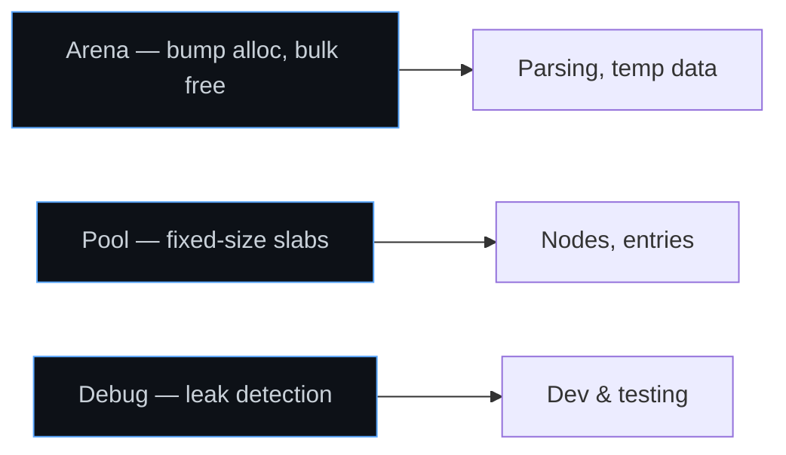
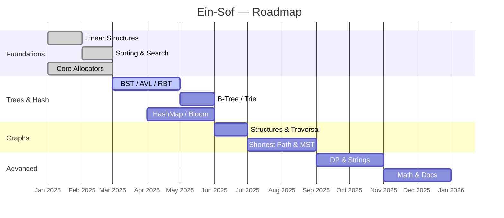

<div align="center">

# Ein-Sof `אין סוף`

**Algorithm Laboratory — Pure C, From Scratch**

_The Net is vast and infinite._

<br>

[](LICENSE)
[](https://en.wikipedia.org/wiki/C99)
[](#)

<br>

Every algorithm. Every data structure. Implemented from nothing —
no external libraries, no abstractions you didn't write,
no ghost in the shell you don't understand.

<br>

[Quickstart](#quickstart) · [Modules](#modules) · [Roadmap](#roadmap) · [Contributing](#contributing)

---

</div>

<br>

## Directives

**01 — Zero dependency.** Every structure is forged from scratch. No foreign ghost in the shell.

**02 — Memory-first.** Manual control over every byte. You know where each pointer lives and when it dies.

**03 — Complexity-aware.** Every implementation annotated with theoretical complexity, then benchmarked on silicon.

**04 — Battle-tested.** 247+ unit tests. Edge cases. Stress tests. Valgrind clean. No leaks. No UB.

<br>

## Architecture

```mermaid
graph TD
    A["Ein-Sof"]:::root --> B["Data Structures"]
    A --> C["Algorithms"]
    A --> D["Mathematics"]
    A --> E["Core"]

    B --> B1["Linear — vector, list, stack, queue, deque"]
    B --> B2["Trees — bst, avl, rbt, b-tree, trie, heap"]
    B --> B3["Hash — hashmap, hashset, bloom filter"]
    B --> B4["Graph — adj list, adj matrix, weighted"]

    C --> C1["Sort — 10 implementations"]
    C --> C2["Search — linear to interpolation"]
    C --> C3["Graph — BFS, DFS, Dijkstra, A*, MST"]
    C --> C4["DP — knapsack, LCS, edit distance, LIS"]

    D --> D1["Arithmetic — bigint, modular, primes"]
    D --> D2["Linear Algebra — matrix ops"]

    E --> E1["Memory — arena, pool, debug alloc"]
    E --> E2["I/O — format, debug, serialize"]

    classDef root fill:#0d1117,stroke:#58a6ff,color:#c9d1d9
```



<br>

## Project Structure

```
ein-sof/
├── include/
│   ├── einsof.h              single entry point
│   ├── ds/                   vector, list, stack, queue, deque,
│   │                         hashmap, hashset, bst, avl, rbtree,
│   │                         btree, trie, heap, graph, bloom
│   ├── algo/                 sort, search, graph_algo, dp, string_algo
│   ├── math/                 bigint, matrix, prime
│   └── core/                 arena, pool, debug, types
├── src/                      mirrors include/
├── tests/                    unit tests (Criterion)
├── bench/                    benchmarks
├── docs/                     COMPLEXITY.md, MEMORY_MODEL.md
├── Makefile
└── LICENSE
```

<br>

## Modules

### Data Structures

<details>
<summary><b>Linear</b> — vector · linked list · stack · queue · deque</summary>

<br>

| Structure   | Description                     | Access | Insert | Delete |
| :---------- | :------------------------------ | :----: | :----: | :----: |
| Vector      | Dynamic array, amortized growth |  O(1)  | O(1)\* |  O(n)  |
| Linked List | Doubly-linked, sentinel nodes   |  O(n)  |  O(1)  |  O(1)  |
| Stack       | LIFO, array-backed              |  O(1)  |  O(1)  |  O(1)  |
| Queue       | FIFO, circular buffer           |  O(1)  |  O(1)  |  O(1)  |
| Deque       | Double-ended queue              |  O(1)  |  O(1)  |  O(1)  |

<sub>\*amortized · all O(n) space</sub>

```c
t_vec *v = es_vec_new(sizeof(int));

for (int i = 0; i < 100; i++)
    es_vec_push(v, &i);

int *ptr = es_vec_at(v, 42);
es_vec_pop(v, NULL);
es_vec_free(v);
```

</details>

<details>
<summary><b>Trees</b> — bst · avl · red-black · b-tree · trie · heap</summary>

<br>

| Structure | Description                  |  Search  |  Insert  |  Delete  |
| :-------- | :--------------------------- | :------: | :------: | :------: |
| BST       | Binary search tree           |   O(h)   |   O(h)   |   O(h)   |
| AVL       | Height-balanced BST          | O(log n) | O(log n) | O(log n) |
| Red-Black | Color-invariant BST          | O(log n) | O(log n) | O(log n) |
| B-Tree    | Multi-way balanced (order m) | O(log n) | O(log n) | O(log n) |
| Trie      | Prefix tree                  |   O(k)   |   O(k)   |   O(k)   |
| Heap      | Min/Max, array-backed        |   O(n)   | O(log n) | O(log n) |

<sub>h = height · k = key length</sub>

```c
t_avl *tree = es_avl_new(int_cmp);
int keys[] = {50, 30, 70, 20, 40, 60, 80};

for (int i = 0; i < 7; i++)
    es_avl_insert(tree, &keys[i]);

es_avl_traverse(tree, ES_INORDER, print_int);
es_avl_free(tree);

// Trie — every character is a synapse
t_trie *trie = es_trie_new();
es_trie_insert(trie, "ghost");
es_trie_insert(trie, "ghoul");

t_vec *completions = es_trie_autocomplete(trie, "gho");
```

</details>

<details>
<summary><b>Hash</b> — hashmap · hashset · bloom filter</summary>

<br>

| Structure    | Description                 | Lookup | Insert | Delete |
| :----------- | :-------------------------- | :----: | :----: | :----: |
| HashMap      | Open addressing, Robin Hood | O(1)\* | O(1)\* | O(1)\* |
| HashSet      | Unique keys, no values      | O(1)\* | O(1)\* | O(1)\* |
| Bloom Filter | Probabilistic membership    |  O(k)  |  O(k)  |   ✗    |

<sub>\*average case · k = hash functions</sub>

```c
t_map *map = es_map_new(sizeof(char *), sizeof(int), str_hash, str_eq);

es_map_put(map, &(char *){"kusanagi"}, &(int){2501});
es_map_put(map, &(char *){"batou"},    &(int){2502});

int *id = es_map_get(map, &(char *){"kusanagi"});
printf("Agent ID: %d\n", *id);  // 2501

es_map_free(map);
```

</details>

<details>
<summary><b>Graph</b> — adjacency list · matrix · weighted · directed</summary>

<br>

```c
t_graph *net = es_graph_new(ES_DIRECTED | ES_WEIGHTED);

size_t a = es_graph_add_vertex(net, "Niihama");
size_t b = es_graph_add_vertex(net, "Newport_City");
size_t c = es_graph_add_vertex(net, "Dejima");

es_graph_add_edge(net, a, b, 4.0);
es_graph_add_edge(net, a, c, 2.0);
es_graph_add_edge(net, c, b, 1.0);

t_edge_iter it = es_graph_neighbors(net, a);
while (es_edge_next(&it))
    printf("%s → %s (%.1f)\n",
        es_graph_label(net, it.from),
        es_graph_label(net, it.to), it.weight);

es_graph_free(net);
```

</details>

<br>

### Algorithms

<details>
<summary><b>Sorting</b> — 10 implementations, bubble → radix</summary>

<br>

| Algorithm      |    Best    |  Average   |   Worst    |  Space   | Stable |
| :------------- | :--------: | :--------: | :--------: | :------: | :----: |
| Bubble Sort    |    O(n)    |   O(n²)    |   O(n²)    |   O(1)   |   ✓    |
| Selection Sort |   O(n²)    |   O(n²)    |   O(n²)    |   O(1)   |   ✗    |
| Insertion Sort |    O(n)    |   O(n²)    |   O(n²)    |   O(1)   |   ✓    |
| Shell Sort     | O(n log n) | O(n^1.25)  |   O(n²)    |   O(1)   |   ✗    |
| Merge Sort     | O(n log n) | O(n log n) | O(n log n) |   O(n)   |   ✓    |
| Quick Sort     | O(n log n) | O(n log n) |   O(n²)    | O(log n) |   ✗    |
| Heap Sort      | O(n log n) | O(n log n) | O(n log n) |   O(1)   |   ✗    |
| Counting Sort  |   O(n+k)   |   O(n+k)   |   O(n+k)   |   O(k)   |   ✓    |
| Radix Sort     |   O(nk)    |   O(nk)    |   O(nk)    |  O(n+k)  |   ✓    |
| Tim Sort       |    O(n)    | O(n log n) | O(n log n) |   O(n)   |   ✓    |

```c
int arr[] = {64, 34, 25, 12, 22, 11, 90};
size_t n = sizeof(arr) / sizeof(arr[0]);

// Generic interface — swap algorithm at will
es_sort(arr, n, sizeof(int), int_cmp, ES_QUICKSORT);

// Fine-tuned control
es_quicksort(arr, n, sizeof(int), int_cmp, ES_PIVOT_MEDIAN3);
es_mergesort(arr, n, sizeof(int), int_cmp, ES_BOTTOM_UP);
```

</details>

<details>
<summary><b>Searching</b> — linear · binary · interpolation · exponential</summary>

<br>

| Algorithm     | Best |   Average    |  Worst   | Requires         |
| :------------ | :--: | :----------: | :------: | :--------------- |
| Linear        | O(1) |     O(n)     |   O(n)   | —                |
| Binary        | O(1) |   O(log n)   | O(log n) | Sorted           |
| Interpolation | O(1) | O(log log n) |   O(n)   | Sorted + uniform |
| Exponential   | O(1) |   O(log n)   | O(log n) | Sorted           |

```c
int data[] = {2, 5, 8, 12, 16, 23, 38, 56, 72, 91};

ssize_t idx = es_bsearch(data, 10, sizeof(int), &(int){23}, int_cmp);
// idx == 5

ssize_t lo = es_lower_bound(data, 10, sizeof(int), &(int){15}, int_cmp);
ssize_t hi = es_upper_bound(data, 10, sizeof(int), &(int){23}, int_cmp);
```

</details>

<details>
<summary><b>Graph Algorithms</b> — traversal · shortest path · MST · topology</summary>

<br>

| Algorithm        |   Complexity   | Category                         |
| :--------------- | :------------: | :------------------------------- |
| BFS              |     O(V+E)     | Traversal                        |
| DFS              |     O(V+E)     | Traversal                        |
| Dijkstra         | O((V+E) log V) | Shortest path                    |
| Bellman-Ford     |     O(V·E)     | Shortest path (negative weights) |
| Floyd-Warshall   |     O(V³)      | All-pairs shortest path          |
| A\*              |      O(E)      | Heuristic shortest path          |
| Kruskal          |   O(E log E)   | Minimum spanning tree            |
| Prim             | O((V+E) log V) | Minimum spanning tree            |
| Tarjan           |     O(V+E)     | Strongly connected components    |
| Topological Sort |     O(V+E)     | DAG ordering                     |

```c
t_path *route = es_dijkstra(network, src, dst);
printf("Distance: %.2f\n", route->distance);
es_path_free(route);

t_path *guided = es_astar(network, src, dst, manhattan_heuristic);

t_vec *order = es_topo_sort(network);  // NULL if cycle
```

</details>

<details>
<summary><b>Dynamic Programming</b> — classic problems, optimized</summary>

<br>

| Problem       |    Time    |    Space    | Method           |
| :------------ | :--------: | :---------: | :--------------- |
| Fibonacci     |    O(n)    |    O(1)     | Bottom-up        |
| Knapsack 0/1  |   O(nW)    |    O(W)     | Space-optimized  |
| LCS           |   O(mn)    | O(min(m,n)) | Hirschberg's     |
| Edit Distance |   O(mn)    | O(min(m,n)) | Wagner-Fischer   |
| LIS           | O(n log n) |    O(n)     | Patience sorting |
| Coin Change   |   O(nS)    |    O(S)     | Bottom-up        |
| Matrix Chain  |   O(n³)    |    O(n²)    | Interval DP      |

```c
t_lcs_result res = es_lcs("ABCBDAB", "BDCAB");
printf("LCS: %s (len %zu)\n", res.sequence, res.length);
es_lcs_free(&res);

size_t dist = es_edit_distance("kitten", "sitting");  // 3

t_item gear[] = {{60, 10}, {100, 20}, {120, 30}};
int best = es_knapsack_01(gear, 3, 50);  // 220
```

</details>

<details>
<summary><b>String Algorithms</b> — pattern matching · hashing</summary>

<br>

| Algorithm    | Complexity  | Use Case                    |
| :----------- | :---------: | :-------------------------- |
| KMP          |   O(n+m)    | Single pattern              |
| Rabin-Karp   |  O(n+m)\*   | Multi-pattern, rolling hash |
| Boyer-Moore  | O(n/m) best | Large alphabets             |
| Aho-Corasick |  O(n+m+z)   | Simultaneous multi-pattern  |
| Z-Algorithm  |    O(n)     | String analysis             |
| Manacher     |    O(n)     | Longest palindrome          |

```c
t_vec *hits = es_kmp_search("AABAACAADAABAABA", "AABA");
// → [0, 9, 12]

t_vec *hits = es_rabin_karp(stream, pattern, ES_HASH_FNV1A);
```

</details>

<br>

### Mathematics

<details>
<summary><b>Arithmetic & Number Theory</b> — bigint · modular · primes</summary>

<br>

```c
t_bigint *a = es_bigint_from_str("123456789012345678901234567890");
t_bigint *b = es_bigint_from_str("987654321098765432109876543210");
t_bigint *c = es_bigint_mul(a, b);

bool p = es_is_prime(1000000007);               // Miller-Rabin
t_vec *primes = es_sieve_of_eratosthenes(1e6);  // all primes ≤ 10⁶

uint64_t r = es_mod_pow(2, 64, 1000000007);
uint64_t inv = es_mod_inv(3, 1000000007);
```

</details>

<details>
<summary><b>Linear Algebra</b> — matrix operations</summary>

<br>

```c
t_matrix *A = es_mat_new(3, 3);
t_matrix *B = es_mat_new(3, 3);

t_matrix *C = es_mat_mul(A, B);            // O(n³)
t_matrix *D = es_mat_mul_strassen(A, B);   // O(n^2.807)

double det    = es_mat_determinant(A);
t_matrix *inv = es_mat_inverse(A);
```

</details>

<br>

### Core Runtime

<details>
<summary><b>Memory Management</b> — arena · pool · debug allocator</summary>

<br>



```c
// Arena — allocate fast, wipe everything at once
t_arena *arena = es_arena_new(4096);
int *data = es_arena_alloc(arena, sizeof(int) * 100);
es_arena_destroy(arena);

// Pool — fixed-size, zero fragmentation
t_pool *pool = es_pool_new(sizeof(t_node), 1024);
t_node *n = es_pool_alloc(pool);
es_pool_free(pool, n);
es_pool_destroy(pool);

// Debug — track every allocation
t_dbg_alloc *dbg = es_dbg_alloc_new();
void *ptr = es_dbg_malloc(dbg, 64, __FILE__, __LINE__);
es_dbg_report(dbg);
// → [LEAK] 64 bytes @ main.c:42
```

</details>

<br>

## Quickstart

**Requirements:** gcc/clang (C99+), make 4.0+, optionally criterion and valgrind.

```bash
git clone https://github.com/yourusername/ein-sof.git
cd ein-sof

make              # build static library
make debug        # with sanitizers
make test         # run 247 tests
make bench        # performance benchmarks
make valgrind     # memory audit
make fclean       # full clean
```

```bash
gcc -I./include my_program.c -L. -leinsof -o my_program
```

```c
#include "einsof.h"

int main(void)
{
    t_vec *v = es_vec_new(sizeof(int));
    for (int i = 0; i < 1000; i++)
        es_vec_push(v, &i);

    es_sort(es_vec_data(v), es_vec_len(v),
            sizeof(int), int_cmp, ES_QUICKSORT);

    ssize_t idx = es_bsearch(es_vec_data(v), es_vec_len(v),
                              sizeof(int), &(int){42}, int_cmp);
    printf("Found 42 at index %zd\n", idx);

    es_vec_free(v);
    return 0;
}
```

<br>

## Testing

Each module has its own test suite using [Criterion](https://github.com/Snaipe/Criterion).

```bash
make test                 # all
make test SUITE=vector    # specific
make test MEMCHECK=1      # with valgrind
```

<details>
<summary><b>Coverage breakdown</b></summary>

<br>

| Module              |  Tests  | Edge Cases | Stress            |
| :------------------ | :-----: | :--------: | :---------------- |
| Vector              |   28    |     ✓      | 10M elements      |
| Linked List         |   24    |     ✓      | ✓                 |
| HashMap             |   32    |     ✓      | High collision    |
| AVL Tree            |   26    |     ✓      | Sequential insert |
| Red-Black Tree      |   30    |     ✓      | ✓                 |
| Sorting             |   40    |     ✓      | 1M elements       |
| Graph Algorithms    |   35    |     ✓      | 100K vertices     |
| String Algorithms   |   22    |     ✓      | ✓                 |
| Dynamic Programming |   18    |     ✓      | —                 |
| **Total**           | **247** |            |                   |

</details>

<br>

## Benchmarks

<details>
<summary><b>Sorting — 1M random integers</b></summary>

<br>

| Algorithm      | Time (ms) | Comparisons |
| :------------- | --------: | ----------: |
| Bubble Sort    |    12,847 |       ~500B |
| Insertion Sort |     6,421 |       ~250B |
| Shell Sort     |        89 |        ~18M |
| Merge Sort     |        62 |        ~20M |
| Quick Sort     |        48 |        ~22M |
| Heap Sort      |        79 |        ~24M |
| Radix Sort     |    **31** |         N/A |
| Tim Sort       |        44 |        ~19M |

</details>

<details>
<summary><b>HashMap — 1M entries, Robin Hood</b></summary>

<br>

| Operation     | Ops/sec | Avg Latency |
| :------------ | ------: | ----------: |
| Insert        |    8.2M |      122 ns |
| Lookup (hit)  |   12.1M |       83 ns |
| Lookup (miss) |   14.3M |       70 ns |
| Delete        |   10.5M |       95 ns |

</details>

<br>

## Roadmap



<br>

## API Convention

All functions follow `es_<module>_<action>()`. Types use `t_` prefix. Snake case everywhere.

| Prefix      | Module      | Examples                        |
| :---------- | :---------- | :------------------------------ |
| `es_vec_`   | Vector      | `es_vec_push()`, `es_vec_at()`  |
| `es_list_`  | Linked List | `es_list_push_back()`           |
| `es_map_`   | HashMap     | `es_map_get()`, `es_map_put()`  |
| `es_avl_`   | AVL Tree    | `es_avl_insert()`               |
| `es_graph_` | Graph       | `es_graph_add_edge()`           |
| `es_sort`   | Sorting     | `es_sort()`, `es_quicksort()`   |
| `es_`       | General     | `es_bsearch()`, `es_dijkstra()` |

<br>

## Contributing

```bash
git checkout -b feat/red-black-tree    # branch
# implement + min 3 tests per function
# edge cases (NULL, empty, single element)
# valgrind clean
make lint
git commit -m "feat(ds): implement red-black tree"
git push origin feat/red-black-tree    # PR
```

Commit types: `feat`, `fix`, `test`, `bench`, `docs`, `refactor`, `style` — always scoped to module.

<br>

## License

MIT — see [LICENSE](LICENSE).

<br>

<div align="center">

---

_The Net is vast and infinite. So are the algorithms within it._

<sub>Built with `gcc`, `vim`, and raw determination.</sub>

</div>
